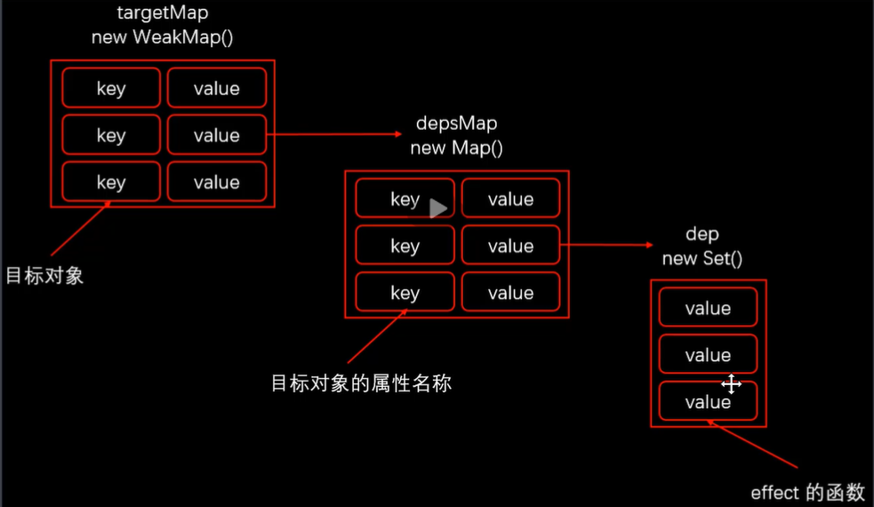

# Vue 3.0

## 源码组织方式

- 采用typescript重写
- 使用monorepo管理项目结构

### compiler-core, -dom, sfc, ssr

平台无关, 浏览器, 单文件组件, 服务端渲染 编译器

sfc依赖于core/dom, ssr依赖于dom

### reactivity

响应式系统, 可以独立使用

### runtime-core, -dom, -test

核心, 浏览器, 测试运行时

dom提供浏览器API

test渲染出来的dom-tree是js对象, 与平台无关, 可以用于测试渲染是否正确, 序列化dom, 触发dom事件, 记录某次操作dom的操作

### server-renderer

服务端渲染

### shared

vue内部使用的api

### size-check

私有包, 不发布, 用于检测tree-shaking后检查包的大小

### template-explorer

浏览器运行的实时编译器, 输出render函数

### vue

构建完整vue

## 不同构建版本

vue/dist/*

### `vue.cjs(.prod).js`

完整版vue, 包含编译器, prod是经过压缩的版本

### global

可以在浏览器通过script标签引用使用, 创建一个全局的vue对象

vue(.runtime).global包含运行时(和编译器)

### browser

浏览器原生模块化代码, 通过`type=module`script标签引入

vue(.runtime).esm-browser

### bundler

`vue(.runtime).esm-bundler.js`没有包含所有代码, 需要配合打包工具使用

都是esm组织方式, 内部使用import导入runtime, core(和compiler)

使用脚手架创建项目默认导出的是`vue.runtime.esm-bundler.js`, 只导入了vue的最小版本, 在项目打包时只会打包使用到的代码, 体积更小

## Composition API

通过RFC向社区收集反馈: [RFC(request for comments)](https://github.com/vuejs/rfcs), [Composition API RFC](https://composition-api.vuejs.org/)

### [设计动机](https://composition-api.vuejs.org/zh/#%E5%8A%A8%E6%9C%BA%E4%B8%8E%E7%9B%AE%E7%9A%84)

options API

- 包含一个描述组件选项的对象: `{ data, methods, props }`
- 这样开发复杂组件时, 同一个功能逻辑的代码被分到不同的选项中

composition API是一组基于函数的API, 提供**更好的逻辑服用与代码组织**, 以及提供**更好的类型推导**

## 性能提升

### 响应式系统

从2的`defineProperty`升级到3的Proxy对象

- 性能提升
- 可以监听动态新增属性
- 可以监听删除属性操作
- 可以监听数组索引和length属性

### 编译优化

2通过标记**静态根节点**, 优化diff过程; 3中**标记并提升所有静态节点**, diff只对比动态节点内容

- fragments, 允许template下多个平行子节点, 需要升级vetur插件
- 静态提升
- patch flag
  - 标记一个动态节点会发生变动的内容属性, 如text是1, prop是8
- 缓存事件处理函数
  - `_cache[0] = (...args) => (_ctx.handler(...args))`
  - 缓存不会被更新, 在运行的时候再实际调用绑定函数, 防止了不必要的更新

### 源码体积优化

移除不常用api

- inline-template
- filter

tree-shaking, 编译时去掉没有引用的模块

## Vite

### 使用ESModule打包

现代浏览器基本支持`ES Module`, 通过`type="module"`加载模块

模块默认延迟加载, 在文档解析完成后, 触发DOMContentLoaded事件前执行

vite在开发模式下不需要打包, 直接运行, 而vue-cli必须使用webpack打包才能运行, 体积更大

### 特点

- 快速冷启动
- 按需编译
- 模块热更新

### 使用

```js
npm init vite-app <project-name>
npm install
npm run dev
// 基于模板
npm init vite-app --template react
npm init vite-app --template preact
```

# [Composition API](https://vue3js.cn/docs/zh/api/global-api.html#createapp)

createApp, setup, reactive

## [生命周期钩子](https://vue3js.cn/docs/zh/api/options-lifecycle-hooks.html)

可以在setup中绑定, 在事件名前加上on, 如`onMounted, onUnmounted`

## API

### reactive

函数返回Proxy对象, 代理执行set, get等

对象不能被解构, 否则不能实现响应式. 因为解构相当于创建两个普通属性, 并使用proxy对象的值初始化, 这可以通过[babel解析器](https://www.babeljs.cn/repl#?browsers=&build=&builtIns=false&spec=false&loose=false&code_lz=MYewdgzgLgBA3jAHgGhgTxgXxgXhgQyA&debug=false&forceAllTransforms=false&shippedProposals=false&circleciRepo=&evaluate=false&fileSize=false&timeTravel=false&sourceType=module&lineWrap=true&presets=es2015%2Creact%2Cstage-2&prettier=false&targets=&version=7.12.3&externalPlugins=)看到

### toRefs

将响应式对象(必须是Proxy)中所有属性也变成响应式的, 解决reactive返回proxy不能解构的问题

### ref

将一个内部值转换为响应式Ref对象, 该对象具有指向内部值的`.value`属性

```js
function useCount() {
  const count = ref(0)
  return {
    count,
    increase: () => count.value++
  }
}
```

### computed

```js
// 单纯监听属性变化
const leftTastNumber = computed(() => {
  return todos.filter(t => !t.completed).length
})
// getter/setter
const count = ref(0)
const plus = computed({
  get: () => count.value + 1,
  set: v => count.value = v - 1
})
```

### watch

```js
watch(data: any, cb: (newValue, oldValue) => void, option: { deep: booleaa, immediate: boolean }): cancelWatchFunc
```

### watchEffect

watch简化版本, 接受一个函数, 并**监听函数内响应式数据的变化**

```js
// 5. 存储待办事项
const useStorage = () => {
  const KEY = 'TODOKEYS'
  const todos = ref(storage.getItem(KEY) || [])
  watchEffect(() => {
    storage.setItem(KEY, todos.value)
  })
  return todos
}
```

### 其他

vue3的v-for支持使用object作为key

```js
import { createApp, reactive, onMounted, onUnmounted } from `./node_modules/vue/dist/vue.esm-browser.js`

function useMousePosition() {
  const position = reactive({
    x: 0, y: 0
  })
  const update = e => {
    position.x = e.pageX
    position.y = e.pageY
  }
  onMounted(() => {
    window.addEventListener('mousemove', update)
  })
  onUnmounted(() => {
    window.removeEventlister('mousemove', update)
  })
  return toRefs(position)
}

const app = createApp({
  setup(() => {
    const { x, y } = usePosition()
  })
})
```

## 自定义指令

```js
app.directive('componentName', {
  beforeMount(el, binding, vnode, prevVnode),
  mounted(),
  beforeUpdate(),
  updated(),
  beforeUnmount(),
  unmounted()
})
app.directive('compnenentName', (el, binding) => {
  binding.value && el.focus()
})
```

# Vue3响应式原理

- 使用Proxy对象实现属性监听
- 多层属性嵌套, 在访问属性的过程中才会处理下一级属性
- 默认监听动态添加的属性, 删除属性操作, 数组索引和length
- 可以作为单独的模块使用

## Reflect对象

ES6中新增, 用于给Object动态改动属性

建议Proxy函数中最后返回Reflect中对应的函数值

严格模式下set, deleteProperty等需要返回Boolean, 使用Reflect对应函数更安全方便

## receiver对象

Proxy: 生成的Proxy对象

Reflect: 改变计算属性中的this指向

Proxy.get里的this指向的是Proxy的第二个参数, 也就是`{ get() { } }`这个对象

## 收集依赖

```js
targetMap: WeakMap() {
  [key: target]: depsMap: Map() {
    [key: targetPropName]: dep: Set() {
      effectMethod
    }
  }
}
```



## ref vs reactive

- ref可以把基本数据类型转换成响应式对象
- ref返回的对象, 重新赋值也是响应式的
- reactive返回的对象, 重新赋值会丢失响应式
- reactive返回的对象解构后丢失响应式

## toRefs

将一个响应式对象转换为普通对象, 该普通对象每个prop都是ref对象

## 实现代码

```js
const hasOwn = (target, key) =>
  Object.prototype.hasOwnProperty.call(target, key);
const isObject = (val) => val !== null && typeof val === "object";
const convert = (target) => (isObject(target) ? reactive(target) : target);

export const reactive = (target) => {
  if (!isObject(target)) {
    return target;
  }

  const handler = {
    get(target, key, receiver) {
      // 收集依赖
      track(target, key);
      const result = Reflect.get(target, key, receiver);
      console.log("get", key);
      return convert(result);
    },
    set(target, key, value, receiver) {
      const oldValue = Reflect.get(target, key, receiver);
      let result = true;
      if (oldValue !== value) {
        console.log("set", key, value);
        result = Reflect.set(target, key, value, receiver);
        // 触发更新
        trigger(target, key);
      }
      return result;
    },
    deleteProperty(target, key) {
      if (hasOwn(target, key)) {
        const result = Reflect.deleteProperty(target, key);
        if (result) {
          console.log("delete", target, key);
          // 触发更新
          trigger(target, key);
        }
        return result;
      }
      return true;
    },
  };

  return new Proxy(target, handler);
};

let activatingEffect = null;
export const effect = (callback) => {
  activatingEffect = callback;
  callback();
  activatingEffect = null;
};

let targetMap = new WeakMap();
export const track = (target, key) => {
  if (!activatingEffect) return;

  let depsMap = targetMap.get(target);
  if (!depsMap) targetMap.set(target, (depsMap = new Map()));

  let deps = depsMap.get(key);
  if (!deps) depsMap.set(key, (deps = new Set()));

  deps.add(activatingEffect);
};

export const trigger = (target, key) => {
  const deps =
    (targetMap.get(target) && targetMap.get(target).get(key)) || new Set();
  Array.from(deps).forEach((dep) => dep());
};

export const ref = (raw) => {
  if (isObject(raw) && raw.__v_isRef) return raw;

  let value = convert(raw);
  const r = {
    __v_isRef: true,
    get value() {
      track(r, "value");
      return value;
    },
    set value(newValue) {
      if (value !== newValue) {
        raw = newValue;
        value = convert(raw);
        trigger(r, "value");
        return true;
      }
    },
  };
  return r;
};

export const toRefs = (target) => {
  // 需要判断target是否是reactive创建的对象, 不是则直接跳过
  const r = target instanceof Array ? new Array(target.length) : {};

  for (key in target) {
    r[key] = toProxyRef(target, key);
  }
  return r;
};

const toProxyRef = (target, key) => {
  return {
    __v_isRef: true,
    get value() {
      return target[key];
    },
    set value(newValue) {
      target[key] = newValue;
    },
  };
};

export const computed = (getter) => {
  const result = ref();

  effect(() => (result = getter()));

  return result;
};

```

# Vite

面向现代浏览器的更轻更快的web应用开发工具, 基于ES Modules实现

依赖于Vite, @vue/compiler-sfc

## 基本

### vite serve

1. 启动webserver, 处理请求
2. 请求文件已存在, 直接返回
3. 否则编译所请求的文件, 并返回, 立即编译, 按需编译

HMR可以立即编译当前所修改的文件

#### vs vue-cli

1. build, 使用webpack打包所有用到的模块代码
2. bundle, 将所有模块切分成不同bundle, 放到内存中
3. 启动webserver
4. 处理请求

HMR需要以改动文件为入口重新build一次, 所有涉及到的依赖都会被加载一遍

### vite build

使用Rollup打包, 只支持ES module的现代浏览器

### 打包 vs 不打包

webpack打包原因

- 浏览器不支持模块化
- 零散的模块文件产生大量的http请求

### 使用

- 内置typescript
- less/sass/stylus/postcss, 内置支持, 需要单独安装
- jsx
- web assembly

### 特点

- 快速冷启动
- 模块热更新
- 按需编译
- 开箱即用

## 实现原理

核心功能

1. 静态web服务器
2. 编译单文件组件
3. 拦截浏览器不识别的模块并处理
4. HMR

## 静态web服务器

使用koa和koa-send

### 静态文件服务

```js
const Koa = require('koa')
const send = require('koa-send')
const app = new Koa()
app.use(async (ctx, next) => {
  await send(ctx, ctx.path, { root: process.cwd(), index: 'index.html' })
  await next()
})
```

### 修改第三方模块的路径

```js
const streamToString = stream => new Promise((resolve, reject) => {
  const chunks = []
  stream.on('data', chunk => chunks.push(chunk))
  stream.on('end', () => resolve(Buffer.concat(chunks).toString('utf-8')))
  stream.on('error', reject)
})

app.use(async (ctx, next) => {
  if (ctx.type === 'application/javascript') {
    const contents = await streamToString(ctx.body)
    // import vue from 'vue' => import vue from '/@modules/vue' 
    ctx.body = contents.replace(/(from\s+['"])(?![\.\/])/g, '$1/@modules/')
  }
})
```

### 加载第三方模块

```js
// 需要写在静态文件中间件之前
app.use(async (ctx, next) => {
  // ctx.path -> /@modules/...
  if (ctx.path.startsWith('/@modules/')) {
    const moduleName = ctx.path.substr('/@modules/'.length)
    const pkgPath = path.join(process.cwd(), 'node_modules', moduleName, 'package.json')
    const pkg = require(pkgPath)
    ctx.path = path.join('/node_modules', moduleName, pkg.module)
  }
  await next()
})
```

### 编译单文件组件

单文件是静态文件, 所以要在静态文件处理之后

单文件中可能引入第三方模块, 所以在修改第三方文件路径之前

```js
// npm i @vue/compiler-sfc
const compilerSFC = require('@vue/compiler-sfc')
const { Readable } = require('stream')

const stringToStream = text => {
  const stream = new Readable()
  stream.push(text)
  stream.push(null)
  return stream
}

app.use(async (ctx, next) => {
  if (ctx.path.endsWith('.vue')) {
    const contents = await streamToString(ctx.body)
    const { descriptor, errors } = compilerSFC.parse(contents)
    let code
    if (!ctx.query.type) { // 第一次请求
      code = descriptor.script.content
      code = code.replace(/export\s+default\s+/g, 'const __script = ')
      code += `
        import { render as __render } from "${ctx.path}?type=template"
        __script.render = __render
        export default __script
      `
    } else {
      const templateRender = compilerSFC.compileTemplate({ source: descriptor.template.content })
      code = templateRender.code
    }
    ctx.body = stringToStream(code)
    ctx.type = 'application/javascript'
  }
  await next()
})
```

### 环境变量替换

node环境使用了process.env变量, 但浏览器环境中没有对应变量, 需要在修改路径的时候一同修改

```js
app.use(async (ctx, next) => {
  if (ctx.type === 'application/javascript') {
    const contents = await streamToString(ctx.body)
    // import vue from 'vue' => import vue from '/@modules/vue' 
    ctx.body = contents
      .replace(/(from\s+['"])(?![\.\/])/g, '$1/@modules/')
    	.replace(/process\.env\.NODE_ENV/g, '"development"')
  }
})
```


